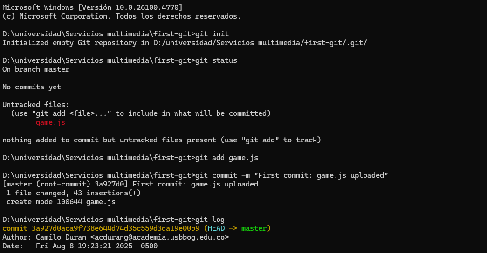
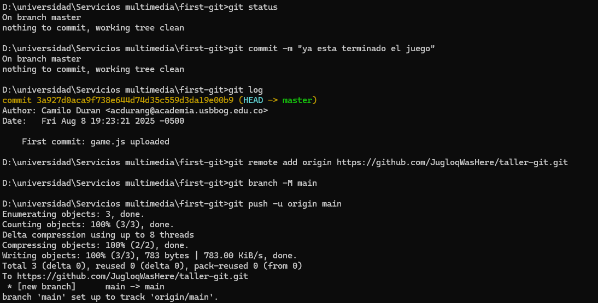
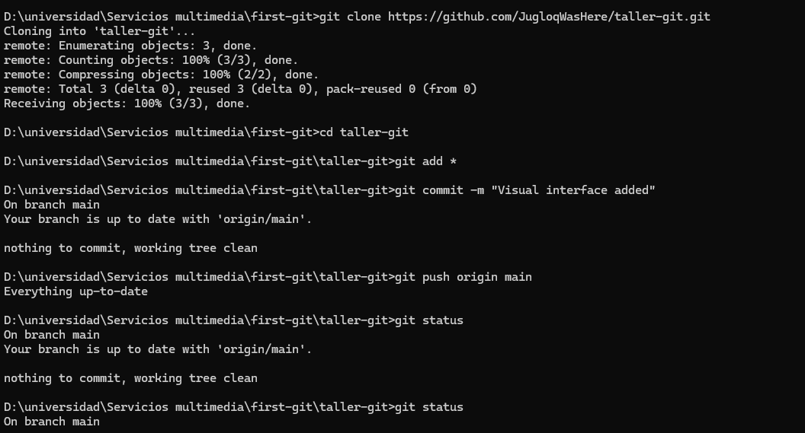
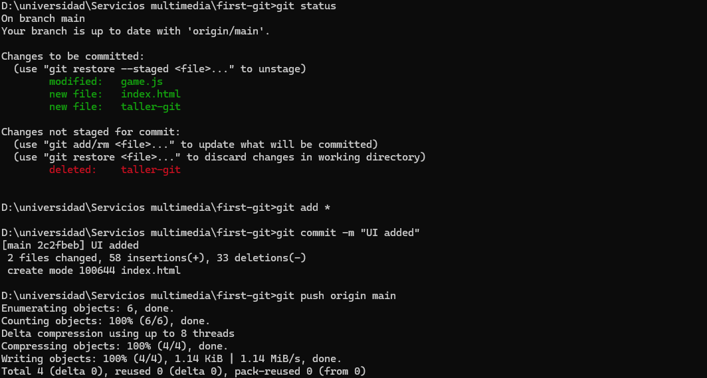
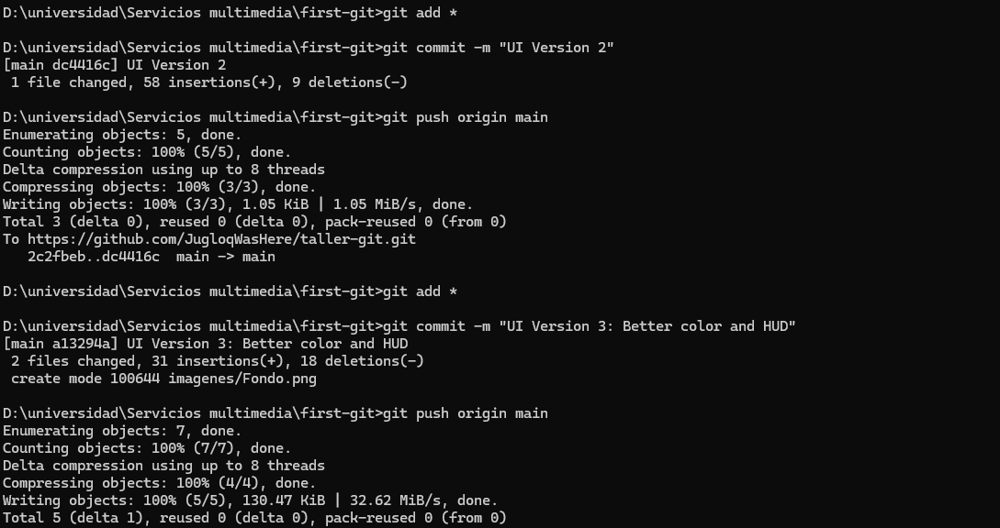

# 🎯 Juego Frío o Caliente  

## 🔥 Adivina el número antes de que se enfríe  
Un juego web donde tendrás que adivinar un número entre 1 y 100.  
Según qué tan cerca estés del número secreto, recibirás pistas visuales y textuales: **"Caliente"** si estás muy cerca, **"Frío"** si estás lejos.  

---

## 📜 Descripción  
Esto es una prueba simple de JavaScript, HTML y CSS
Está pensado como una practica para el manejo de git y github:  

---

## 🖼 Capturas de pantalla  
_Añade aquí las imágenes de tu proyecto (puedes subirlas a GitHub y luego enlazarlas):_

  
  
  
  
  
  

---

